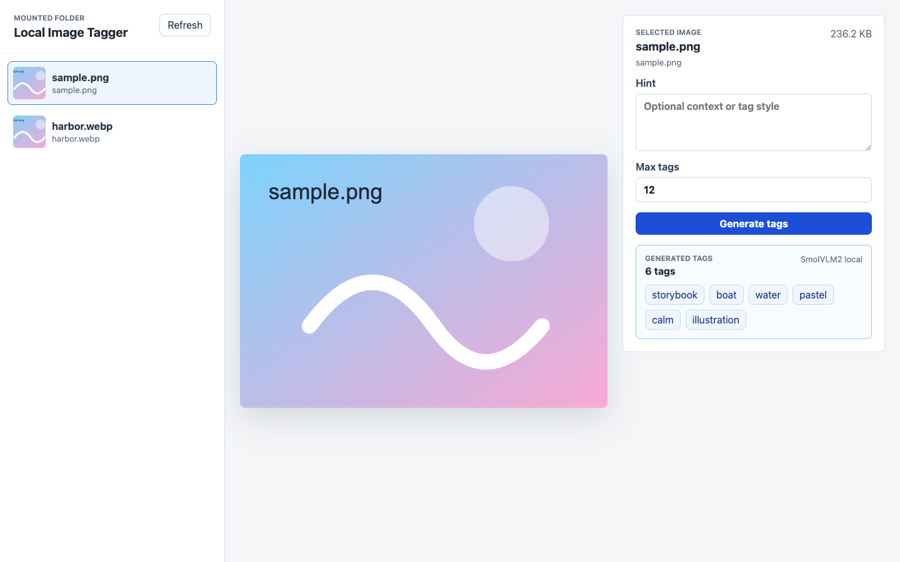

<!--
Generated from kit-meta.json by scripts/demo-kit-standard.mjs.
Update kit-meta.json or capability.yml, then rerun the generator instead of hand-editing generated README sections.
-->

# Local Image Tagger

Local AI app Kit for tagging images from a mounted folder with a local vision model.



**Tags:** `web-ui` `vision` `image-tagging` `llama.cpp` `mcp` `local-ai` `react` `vite` `typescript` `bun`

## What It Does

- Lists images from a read-only local folder.
- Tags selected images with a bundled local vision model dependency.
- Exposes both a browser UI and an MCP image-tagging tool.

## Technologies

- CapaKit MCP endpoint
- CapaKit HTTP workload
- Bundled llama.cpp AI app Kit dependency
- React
- Vite
- TypeScript
- Bun

## App Kit Info

```text
AI app Kit: local-image-tagger

Exposes
- Public path: /mcp
  Protocols:
    - Protocol: mcp
      Path: /mcp
  Default MCP: yes
- Public path: /
  Protocols:
    - Protocol: http
      Path: /http

Requires
Secrets:
No secrets declared.

Host mounts:
- images [read_only]
  Usage: Folder of local images to tag

- models [read_write]
  Usage: Local GGUF model cache for the bundled llama.cpp dependency

Options:
- gpu [enum, default=metal, values=none|metal]: Local GPU acceleration mode for the bundled llama.cpp dependency.
- llama_context_size [number, default=8192]: Context size passed through to the bundled llama.cpp dependency.
- vision_model [string, default=ggml-org/SmolVLM2-500M-Video-Instruct-GGUF:Q8_0]: Vision-capable GGUF/Hugging Face model spec used for image tagging.

External services
No external services declared.

AI app Kit dependencies
- llama: repo package https://github.com/capakit/llama-cpp-local-kit (default bundled AI app Kit)
  Options passed:
  - context_size <- option llama_context_size (default: 8192)
  - default_model <- option vision_model (default: ggml-org/SmolVLM2-500M-Video-Instruct-GGUF:Q8_0)
  - gpu <- option gpu (default: metal)
  Mounts passed:
  - models <- models (Local GGUF model cache for the bundled llama.cpp dependency)

Commands
- Run:
  capakit run https://github.com/capakit/local-image-tagger-demo-kit \
    --mount images=<path-to-images> \
    --mount models=~/.capakit/models
- Test:
  capakit test .
```

## Run

```sh
capakit run https://github.com/capakit/local-image-tagger-demo-kit \
--mount images=<path-to-images> \
--mount models=~/.capakit/models
```

## Install As A Skill

```sh
capakit run https://github.com/capakit/local-image-tagger-demo-kit --global-skill codex \
--mount images=<path-to-images> \
--mount models=~/.capakit/models
```

## Test

```sh
capakit test .
```

## Security

Vault secrets are user-provided secrets available only to trusted integrations such as secure exit nodes. Kit secrets are Kit-local secrets that can be exposed to code workloads.

## About CapaKit

CapaKit runs AI app Kits locally with isolated workloads, explicit mounts, and agent-friendly commands. Learn more at https://capakit.com.

More AI app Kits: https://github.com/capakit/apps
